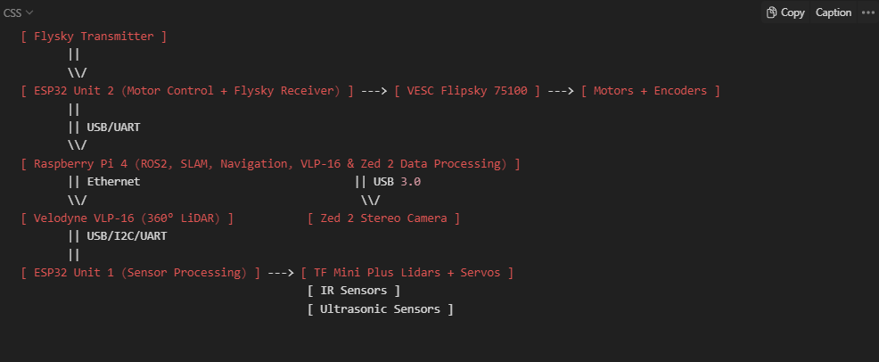

# Project README: Modular Robotics Control and Navigation System

## Project Overview

The aim of this project is to enhance modularity, scalability, and efficiency of a robotics control and navigation system through strategic hardware and software partitioning. This involves segregating motor control and essential safety sensors from mapping and AI-driven sensors across distinct ESP32 boards. This approach is intended to simplify code management, enhance direct control capabilities, increase system modularity, enable specialized and streamlined codebases, and improve scalability.

Key components of the project include:

- **Separation of Control**: Dividing motor control and safety sensor operations from mapping and AI sensor tasks onto separate ESP32 boards.
- **Integration with ROS2**: Utilizing micro-ROS on both units for seamless integration with a central ARM processor running ROS2, facilitating both autonomous and manual operation modes.

## Communication and Control Flow

### Autonomous Navigation and Environmental Mapping

- The system leverages a Raspberry Pi for processing data from the Velodyne VLP-16 and Zed 2 camera, integrating LiDAR-based and visual SLAM for enhanced environmental mapping and obstacle avoidance capabilities.

## System Layout and Interactions

### Remote Control and Motor Management

- **Flysky Transmitter to ESP32 (Motor Control + Flysky Receiver)**: The Flysky Receiver connects directly to ESP32 Unit 2, tasked with interpreting remote control inputs for direct motor management. This unit employs VESC motor controllers for precise motor operation.

### Command and Control

- **ESP32 Unit 2 to Raspberry Pi 4**: This link enables advanced command and control operations, allowing ESP32 Unit 2 to send encoder feedback or receive navigational commands from the Raspberry Pi 4, which manages ROS2, SLAM, and sensor data processing.

### Sensor Data Processing

- **Raspberry Pi 4 to Velodyne VLP-16 and Zed 2 Stereo Camera**: Direct interfacing with these sensors enables the Raspberry Pi 4 to perform SLAM and navigation tasks, informing motor control decisions sent to ESP32 Unit 2.
- **ESP32 Unit 1 (Sensor Processing)**: Dedicated to processing data from sensors such as TF Mini Plus Lidars, IR sensors, and ultrasonic sensors, ESP32 Unit 1 provides critical environmental data to the Raspberry Pi 4 for comprehensive navigational decision-making.

## Key Interactions and Data Flows

- **Remote Control Operation**: Enables direct motor control via the Flysky Transmitter to ESP32 Unit 2, facilitating manual override or direct control scenarios.
- **Autonomous Navigation**: The Raspberry Pi 4, equipped with data from the VLP-16, Zed 2, and ESP32 Unit 1, orchestrates navigational decisions, relaying motor command adjustments to ESP32 Unit 2.
- **Sensor Data Integration**: ESP32 Unit 1 acts as a dedicated hub for proximity sensing and environmental mapping, funneling data to the Raspberry Pi 4 for enriched SLAM and navigational processes.
- **Dedicated Processing**: Task-specific allocation to microcontrollers (ESP32s) and microprocessors (Raspberry Pi) ensures optimal performance, streamlined codebases, and effective task management.
- **Parallel Processing**: Distributing tasks across multiple processors allows for concurrent sensor reading, motor control, and computational processes, such as SLAM, enhancing system efficiency and responsiveness.

